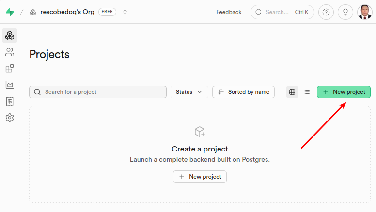
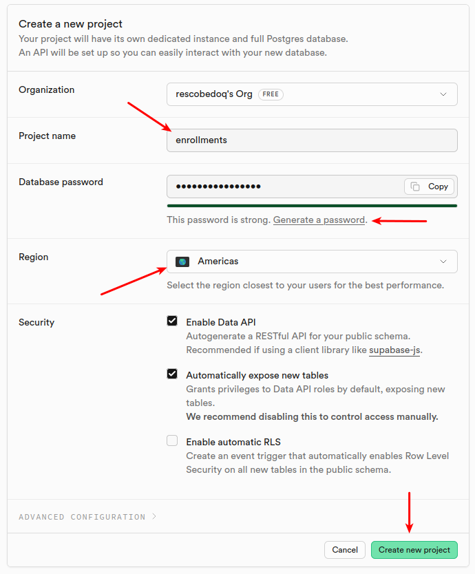
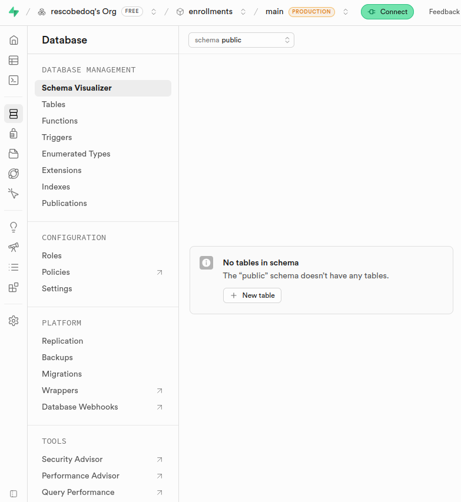
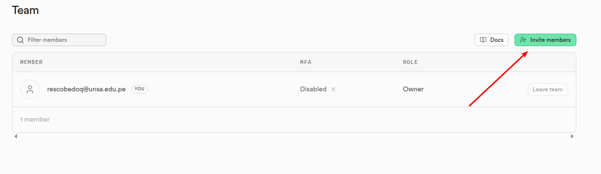

# Tutorial: Guía Completa de Supabase

## Tabla de Contenidos
1. [Acceder a Supabase](#acceder-a-supabase)
2. [Crear Nuevo Proyecto](#crear-nuevo-proyecto)
3. [Acceder a la Vista de Base de Datos](#acceder-a-la-vista-de-base-de-datos)
4. [Agregar Miembros al Proyecto](#agregar-miembros-al-proyecto)

---

## Acceder a Supabase

### Paso 1: Ir al sitio web de Supabase
- Abre tu navegador web
- Ve a [https://supabase.com](https://supabase.com)
- Haz clic en el botón **"Sign In"** (Iniciar sesión) en la esquina superior derecha

### Paso 2: Iniciar sesión
Puedes iniciar sesión con:
- **GitHub**: Recomendado y más rápido
- **Google**: Otra opción de autenticación
- **Email y contraseña**: Si ya tienes una cuenta creada

### Paso 3: Autenticar tu cuenta
- Si es tu primer acceso, sigue el proceso de autenticación
- Verifica tu email si es necesario
- Completa cualquier verificación requerida (2FA si lo tienes habilitado)

### Paso 4: Acceder al Dashboard
- Una vez autenticado, serás redirigido al dashboard principal de Supabase
- Verás la lista de tus proyectos existentes




---

## Crear Nuevo Proyecto

### Paso 1: Ir a la sección de proyectos
- En el dashboard, busca el botón **"New Project"** (Nuevo Proyecto)
- Generalmente está en la esquina superior derecha o en el centro de la pantalla si no tienes proyectos

### Paso 2: Seleccionar organización
- Si tienes múltiples organizaciones, selecciona la organización donde deseas crear el proyecto
- Si es tu primer proyecto, aparecerá tu organización personal por defecto

### Paso 3: Configurar el nuevo proyecto
Completa el formulario con la siguiente información:

| Campo | Descripción | Ejemplo |
|-------|-------------|---------|
| **Project Name** | Nombre del proyecto | Mi Base de Datos |
| **Database Password** | Contraseña para la base de datos | GeneraUnaContraseñaSegura123! |
| **Region** | Región geográfica del servidor | South America (São Paulo) |
| **Pricing Plan** | Plan de suscripción | Free (Gratuito) |

### Paso 4: Revisar configuración
- Verifica que todos los datos sean correctos
- Lee los términos de servicio si es necesario
- Haz clic en **"Create New Project"** (Crear Nuevo Proyecto)

### Paso 5: Esperar inicialización
- Supabase creará tu proyecto (puede tomar 2-5 minutos)
- Verás una barra de progreso
- Una vez completado, serás redirigido automáticamente al dashboard del proyecto



---

## Acceder a la Vista de Base de Datos

### Paso 1: Abrir el panel de control del proyecto
- Desde el dashboard principal, haz clic en el proyecto que deseas utilizar
- Se abrirá el panel de control (Dashboard) del proyecto

### Paso 2: Navegar a la sección de Base de Datos
- En el menú lateral izquierdo, busca la opción **"Database"** (Base de Datos) o **"SQL Editor"**
- El menú generalmente está estructurado así:
  ```
  Project Home
  SQL Editor
  Database
    ├── Tables
    ├── Views
    ├── Functions
    └── Triggers
  Authentication
  Storage
  ```

### Paso 3: Explorar las opciones de Base de Datos
Una vez en la vista de Base de Datos, puedes:

- **Ver tablas existentes**: Lista todas tus tablas en la parte izquierda
- **Crear nueva tabla**: Botón **"+ New Table"** (Nueva Tabla)
- **Editor SQL**: Tab **"SQL Editor"** para escribir consultas SQL personalizadas
- **Ver datos**: Haz clic en cualquier tabla para ver su contenido

### Paso 4: Crear una tabla de prueba (Opcional)
Si deseas practicar:
1. Haz clic en **"+ New Table"**
2. Nombre: `usuarios`
3. Agrega columnas:
   - `id` (UUID, Primary Key)
   - `nombre` (Text)
   - `email` (Text)
   - `created_at` (Timestamp)
4. Haz clic en **"Save"** (Guardar)



---

## Agregar Miembros al Proyecto

### Paso 1: Acceder a la configuración del proyecto
- En el panel de control del proyecto, busca el ícono de **engranaje** ⚙️ en la esquina superior derecha
- O busca la opción **"Settings"** (Configuración) en el menú lateral

### Paso 2: Ir a la sección de Miembros
- En el menú de Configuración, busca la opción **"Team"** o **"Members"** (Equipo o Miembros)
- Se abrirá la lista de miembros actuales del proyecto

### Paso 3: Invitar nuevo miembro
- Haz clic en el botón **"+ Invite"** o **"+ Add Member"** (Agregar Miembro)
- Se abrirá un cuadro de diálogo

### Paso 4: Ingresar detalles del miembro
Completa los siguientes campos:

| Campo | Descripción |
|-------|-------------|
| **Email** | Correo electrónico del miembro a invitar |
| **Role** | Rol del miembro (Owner, Developer, Viewer, etc.) |

**Roles disponibles:**
- **Owner** (Propietario): Control total del proyecto
- **Developer** (Desarrollador): Puede editar y crear recursos
- **Viewer** (Visualizador): Solo lectura, no puede hacer cambios
- **Billing** (Facturación): Acceso solo a configuración de facturación

### Paso 5: Enviar invitación
- Haz clic en **"Send Invite"** o **"Invite"** (Enviar Invitación)
- Supabase enviará un correo de invitación al miembro
- El miembro recibirá un enlace para unirse al proyecto

### Paso 6: Verificar miembros agregados
- En la lista de Miembros, verás:
  - **Miembros activos**: Aquellos que ya aceptaron la invitación
  - **Invitaciones pendientes**: Aquellos que aún no han aceptado
- Los miembros pendientes mostrarán un estado "Pending" o "Invitado"

### Paso 7: Revocar acceso (Si es necesario)
- Junto a cada miembro, hay un ícono de **menú** (tres puntos) o **basura**
- Haz clic para ver opciones como:
  - **Change Role** (Cambiar Rol)
  - **Remove** (Eliminar)



---

## Resumen de Roles y Permisos

| Rol | Crear Recursos | Editar Recursos | Eliminar Recursos | Ver Datos | Agregar Miembros |
|-----|---|---|---|---|---|
| **Owner** | ✅ | ✅ | ✅ | ✅ | ✅ |
| **Developer** | ✅ | ✅ | ✅ | ✅ | ❌ |
| **Viewer** | ❌ | ❌ | ❌ | ✅ | ❌ |
| **Billing** | ❌ | ❌ | ❌ | ❌ | ❌ |

---

## Consejos Importantes

✅ **Recomendaciones:**
- Usa contraseñas fuertes para tu base de datos
- Haz copias de seguridad regularmente
- Establece políticas de Row Level Security (RLS) para proteger datos
- Revisa los miembros del proyecto periódicamente
- Usa variablesde entorno para guardar credenciales sensibles

⚠️ **Advertencias:**
- No compartas tu contraseña de base de datos con nadie
- Ten cuidado al compartir acceso de Owner
- Revisa los logs de auditoría para cambios importantes
- Considera habilitar 2FA en tu cuenta Supabase

---

## Enlaces Útiles
- [Documentación oficial de Supabase](https://supabase.com/docs)
- [Panel de Control de Supabase](https://app.supabase.com)
- [Comunidad de Supabase](https://discord.gg/supabase)

---

**Última actualización:** Mayo 2026
